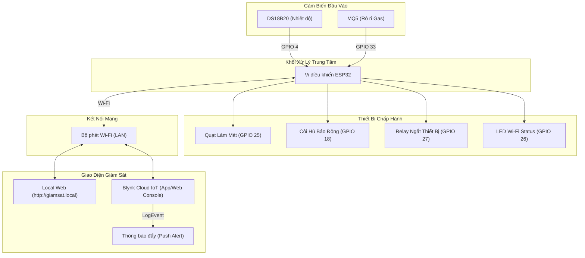

# Hệ thống Giám sát Môi trường sử dụng ESP32, Blynk IoT và Local Web Server


Hệ thống IoT giám sát các thông số môi trường (nhiệt độ, nồng độ khí gas/khói) thời gian thực sử dụng vi điều khiển ESP32. Thiết bị hỗ trợ tự động kích hoạt quạt làm mát và các cảnh báo khẩn cấp (còi báo động, rơ-le ngắt nguồn phụ tải) khi các thông số vượt ngưỡng an toàn.

Hệ thống tích hợp hai kênh giám sát độc lập (Dual-Control/Dual-Monitor):
1. **Giám sát và điều khiển từ xa qua Blynk IoT Cloud:** Cho phép theo dõi số liệu trực quan, điều khiển bật/tắt thiết bị, thay đổi các ngưỡng cảnh báo động qua ứng dụng điện thoại và tự động gửi thông báo push alert khi phát hiện sự cố rò rỉ khí gas hoặc quá nhiệt.
2. **Trang Web nội bộ (Local Web Server):** ESP32 tự khởi chạy một web server cục bộ hiển thị dashboard dữ liệu. Web server được gán mDNS cục bộ **`http://giamsat.local`** để người dùng trong cùng mạng Wi-Fi truy cập trực tiếp không cần nhớ địa chỉ IP của mạch.

---

## 1. Các tính năng chính của hệ thống

* **Đo nhiệt độ:** Sử dụng cảm biến **DS18B20** giao tiếp chuẩn 1-Wire.
* **Đo nồng độ khí gas:** Sử dụng cảm biến **MQ5** kết nối qua chân Analog (ADC) để phát hiện khí LPG, Methane ($CH_4$), hoặc khói.
* **Điều khiển thiết bị chấp hành tự động:**
  * **Quạt tản nhiệt (FAN):** Tự động bật khi nhiệt độ môi trường vượt ngưỡng `tempThreshold`.
  * **Còi báo (Buzzer) & Relay ngắt điện:** Tự động kích hoạt đồng thời khi nồng độ khí vượt ngưỡng cảnh báo `smokeThreshold`.
* **Cảnh báo khẩn cấp:** Gửi cảnh báo push notification về điện thoại qua dịch vụ Blynk LogEvent ngay khi phát hiện rò rỉ gas/quá nhiệt (cơ chế chống spam lặp lại liên tục).
* **Đồng bộ tham số 2 chiều:** Đồng bộ các ngưỡng điều chỉnh trên ứng dụng Blynk và thiết bị sau mỗi lần khởi động lại thông qua hàm `Blynk.syncVirtual`.

---

## 2. Sơ đồ kiến trúc Hệ thống (System Architecture)



---

## 3. Sơ đồ kết nối phần cứng (Pinout)

Kết nối các chân IO của vi điều khiển ESP32 với linh kiện ngoại vi:

| Linh Kiện | Chân kết nối ESP32 (GPIO) | Ghi Chú |
| :--- | :---: | :--- |
| **Cảm biến DS18B20** | **GPIO 4** | Cần điện trở kéo lên $4.7\text{k}\Omega$ nối giữa chân DATA và 3.3V |
| **Cảm biến MQ5** | **GPIO 33 (AO)** | Đọc tín hiệu Analog từ MQ5 (Cấp nguồn VCC 5V riêng cho cảm biến) |
| **Còi báo (Buzzer)** | **GPIO 18** | Sử dụng còi báo tích cực điều khiển qua Transistor NPN (2N2222) |
| **Quạt tản nhiệt** | **GPIO 25** | Điều khiển đóng cắt nguồn quạt qua MOSFET (IRLZ44N) hoặc Relay |
| **Module Relay** | **GPIO 27** | Đóng cắt nguồn phụ tải, cấp nguồn 5V riêng cho cuộn hút rơ-le |
| **LED Wi-Fi Status** | **GPIO 26** | LED báo trạng thái Wi-Fi (sáng khi kết nối thành công, nháy khi mất mạng) |

> [!IMPORTANT]
> **Lưu ý phần cứng quan trọng:**
> 1. Cảm biến **MQ5** cần nguồn **5V** ổn định để duy trì dây sấy bên trong hoạt động chính xác. Không cấp nguồn 3.3V từ ESP32 vì sẽ làm sai lệch giá trị đo.
> 2. Cảm biến **DS18B20** bắt buộc có điện trở kéo lên $4.7\text{k}\Omega$ kết nối giữa dây DATA và 3.3V. Thiếu trở kéo này, cảm biến sẽ trả về giá trị `-127°C`.
> 3. Cấp nguồn tổng cho mạch nên dùng bộ nguồn USB tối thiểu $5\text{V} - 2\text{A}$ để tránh hiện tượng sụt áp (Brownout) gây reset chip khi quạt, còi và Wi-Fi hoạt động cùng lúc.

---

## 4. Cấu trúc thư mục mã nguồn

```text
blink/
├── blink.ino              <-- Mã nguồn firmware chính (Blynk IoT + Web Server + mDNS)
├── hardware_test/
│   └── hardware_test.ino  <-- Mã nguồn chẩn đoán và kiểm tra phần cứng đơn lẻ
└── relay_test/
    └── relay_test.ino     <-- Script kiểm tra hoạt động đóng/ngắt của rơ-le
```

---

## 5. Hướng dẫn nạp chương trình và cấu hình

### Bước 1: Chuẩn bị phần mềm
* Cài đặt **Arduino IDE** (khuyến nghị phiên bản 2.x trở lên).
* Thêm board ESP32 vào trình quản lý Boards Manager bằng đường dẫn: `https://raw.githubusercontent.com/espressif/arduino-esp32/gh-pages/package_esp32_index.json`
* Cài đặt các thư viện cần thiết thông qua Library Manager:
  * `Blynk` (by Volodymyr Shymanskyy)
  * `OneWire` (by Paul Stoffregen)
  * `DallasTemperature` (by Miles Burton)

### Bước 2: Cấu hình thông số trên Blynk Console
Tạo các Datastreams và sự kiện trên Blynk Template:
1. **Datastreams (Virtual Pins):**
   * **V0:** Double/Float (Đọc nhiệt độ).
   * **V1:** Integer (Đọc nồng độ khí gas).
   * **V2:** Double/Float, Read/Write (Slider thay đổi ngưỡng nhiệt độ).
   * **V3:** Integer, Read/Write (Slider thay đổi ngưỡng khí gas).
2. **Events & Notifications (Sự kiện cảnh báo):**
   * Tạo Event 1: Event Code là **`canh_bao_nhiet`** (viết thường). Bật thông báo đẩy (push notification) trên điện thoại.
   * Tạo Event 2: Event Code là **`canh_bao_gas`** (viết thường). Bật thông báo đẩy trên điện thoại.

---

## 6. Quy trình chạy thử nghiệm và kiểm tra chức năng

### Giai đoạn 1: Kiểm tra phần cứng đơn lẻ
1. **Kiểm tra Rơ-le:** Nạp chương trình tại tệp `relay_test/relay_test.ino` xuống ESP32. Rơ-le phải đóng/ngắt đều đặn mỗi 2 giây kèm theo tiếng tiếp điểm đóng ngắt.
2. **Kiểm tra cảm biến và ngoại vi:** Nạp chương trình `hardware_test/hardware_test.ino`. Mở Serial Monitor với tốc độ **115200 baud**, nhập phím `7` (hoặc nhập từ `1` đến `6`) để chẩn đoán hoạt động của từng linh kiện riêng biệt.

### Giai đoạn 2: Kiểm tra Web Server cục bộ
1. Nạp mã nguồn chính tại tệp `blink.ino`.
2. Kết nối máy tính hoặc điện thoại vào chung mạng Wi-Fi với ESP32.
3. Mở trình duyệt web và nhập địa chỉ: **`http://giamsat.local`**
4. Giao diện web hiển thị các thông số nhiệt độ và khí gas sẽ tự động tải dữ liệu mỗi 2 giây một lần.

### Giai đoạn 3: Kiểm tra cơ chế tự động cảnh báo
1. Mở ứng dụng Blynk trên điện thoại song song với Web Server.
2. **Cảnh báo quá nhiệt:** Kéo Slider ngưỡng nhiệt độ (**V2**) xuống thấp hơn nhiệt độ môi trường thực tế. Quạt làm mát (GPIO 25) phải lập tức quay, giao diện web chuyển sang cảnh báo đỏ, điện thoại nhận được thông báo đẩy báo nhiệt độ cao.
3. **Cảnh báo rò rỉ gas:** Kéo Slider ngưỡng khí gas (**V3**) xuống thấp hơn giá trị đo thực tế, hoặc xịt nhẹ khí gas từ bật lửa vào cảm biến MQ5. Còi báo (GPIO 18) phải kêu, rơ-le (GPIO 27) đóng tiếp điểm, giao diện chuyển cảnh báo đỏ và điện thoại nhận được thông báo đẩy báo rò rỉ khí gas.
