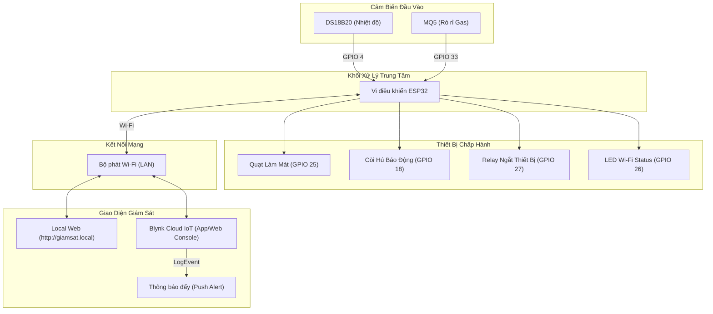

# 🌿 Dự Án Giám Sát Môi Trường Thông Minh (ESP32 - Blynk IoT - Web Server)

Chào mừng bạn đến với tài liệu hướng dẫn chi tiết của dự án **Giám sát môi trường**. Đây là một hệ thống IoT hoàn chỉnh sử dụng vi điều khiển **ESP32** để theo dõi nhiệt độ phòng và nồng độ khí gas/khói theo thời gian thực, đồng thời tự động kích hoạt quạt làm mát và hệ thống cảnh báo (còi hú, relay ngắt khẩn cấp) khi có sự cố xảy ra.

Dự án sở hữu tính năng **Dual-Control/Dual-Monitor**:
1. **Giám sát & Điều khiển từ xa qua Blynk IoT Cloud**: Biểu đồ trực quan, đẩy dữ liệu liên tục, tự động gửi **thông báo đẩy (Push Notifications) khẩn cấp** về điện thoại khi có sự cố và cho phép người dùng cấu hình ngưỡng cảnh báo bằng thanh kéo (Slider).
2. **Trang Web nội bộ (Local Web Server)**: Giao diện web được thiết kế theo phong cách **Glassmorphism UI** hiện đại, mượt mà, phản hồi siêu nhanh trực tiếp từ mạch qua mạng LAN/Wi-Fi cục bộ sử dụng tên miền thông minh **`http://giamsat.local`** mà không cần nhớ IP.

---

## 📌 Các Tính Năng Nổi Bật

*   **Đo nhiệt độ chính xác**: Sử dụng cảm biến **DS18B20** giao tiếp qua chuẩn 1-Wire, dải đo rộng và cực kỳ ổn định.
*   **Đo khí gas rò rỉ nhạy bén**: Sử dụng cảm biến **MQ5** (kết nối chân Analog) phát hiện sớm các nguy cơ rò rỉ khí gas hóa lỏng LPG, Methane ($CH_4$), hoặc gas tự nhiên.
*   **Điều khiển tự động thông minh**:
    *   **Quạt làm mát (FAN)** tự động bật khi nhiệt độ vượt quá ngưỡng cài đặt (`tempThreshold`).
    *   **Còi báo (BUZZER)** và **Relay (thiết bị an toàn)** tự động kích hoạt ngay khi nồng độ khí gas vượt ngưỡng an toàn (`smokeThreshold`).
*   **Thông báo khẩn cấp tức thời**: Tích hợp dịch vụ **Blynk LogEvent** gửi thông báo đẩy trực tiếp về điện thoại/email của người dùng ngay khi xảy ra sự cố (đã lọc tránh spam lặp lại).
*   **Giao diện Glassmorphism Web hiện đại**: Hiển thị dữ liệu dạng thẻ (Card) thời thượng, hỗ trợ hiệu ứng chuyển động vi mô (micro-animations), chế độ cảnh báo nhấp nháy đỏ khi có sự cố nguy hiểm và cơ chế tự kết nối lại nếu mất mạng.
*   **Đồng bộ hóa Blynk 2-way**: Đồng bộ các thông số cấu hình ngưỡng cảnh báo giữa ESP32 và Server Blynk ngay cả khi khởi động lại (`Blynk.syncVirtual`).

---

## 📊 Sơ Đồ Kiến Trúc Hệ Thống (Architecture)



---

## 🛠️ Cấu Hình Phần Cứng & Sơ Đồ Nối Chân

Dưới đây là sơ đồ kết nối các chân IO của ESP32 với các linh kiện ngoại vi:

| Thiết Bị | Loại Linh Kiện | Chân ESP32 (GPIO) | Ghi Chú |
| :--- | :--- | :---: | :--- |
| **DS18B20** | Cảm biến Nhiệt độ | **GPIO 4** | Cần trở kéo lên **4.7kΩ** nối giữa chân VCC (3.3V) và chân Data. |
| **MQ5** | Cảm biến Rò rỉ Gas | **GPIO 33** | Kết nối chân **AO (Analog Output)** vào ESP32. |
| **BUZZER** | Còi báo động | **GPIO 18** | Dùng còi báo tích cực (Active Buzzer) hoặc qua Transistor đệm. |
| **FAN** | Quạt làm mát (5V/12V) | **GPIO 25** | Điều khiển qua Transistor (C1815/IRF540) hoặc Relay Module. |
| **RELAY** | Relay ngắt điện / thiết bị phụ | **GPIO 27** | Sử dụng Module Relay cách ly quang (Optocoupler). |
| **LED STATUS**| LED hiển thị Wi-Fi | **GPIO 26** | Đèn sáng: Wi-Fi Connected | Đèn tắt/nhấp nháy: Wi-Fi Disconnected. |

> [!IMPORTANT]
> **Lưu ý lắp ráp phần cứng:**
> - Cảm biến **MQ5** cần nguồn **5V** ổn định để sấy nóng cuộn dây cảm ứng bên trong. Nếu cấp nguồn 3.3V, kết quả đo analog sẽ rất thấp và không chính xác.
> - Cảm biến **DS18B20** bắt buộc phải có trở kéo lên **4.7kΩ** từ chân Data lên VCC (3.3V). Nếu không có trở này, ESP32 sẽ báo lỗi không tìm thấy cảm biến (`-127 °C`).
> - **Cấp nguồn:** Cần sử dụng nguồn điện tốt (Củ sạc 5V - 2A) để tránh hiện tượng sụt áp (Brownout) khi Wi-Fi truyền tải dữ liệu đồng thời với việc Rơ-le, Quạt và Còi hoạt động.

---

## 📂 Cấu Trúc Thư Mục Dự Án

Thư mục dự án được tổ chức gọn gàng và dễ dàng nạp code:

```text
blink/
├── blink.ino              <-- Mã nguồn chính của dự án (Blynk IoT + Web Server + mDNS)
├── code.TXT               <-- Bản lưu mã nguồn sơ cua (để tham khảo)
├── .gitignore             <-- File cấu hình loại bỏ file rác khi đẩy lên GitHub
├── README.md              <-- Hướng dẫn này (Tài liệu dự án)
├── hardware_test/
│   └── hardware_test.ino  <-- Mã nguồn TEST PHẦN CỨNG độc lập qua Serial Monitor
└── relay_test/
    └── relay_test.ino     <-- Mã nguồn TEST CHUYÊN BIỆT RELAY (nhấp nháy mỗi 2 giây)
```

---

## 🚀 Hướng Dẫn Cấu Hình Phần Mềm

### 1. Cài đặt môi trường
*   Tải và cài đặt **Arduino IDE** phiên bản mới nhất (khuyến nghị 2.x).
*   Thêm board ESP32 vào Arduino IDE:
    1.  Vào `File` -> `Preferences`.
    2.  Tại ô `Additional Boards Manager URLs`, dán đường dẫn: `https://raw.githubusercontent.com/espressif/arduino-esp32/gh-pages/package_esp32_index.json`
    3.  Vào `Tools` -> `Board` -> `Boards Manager`, tìm kiếm `esp32` và ấn **Install**.

### 2. Cài đặt Thư viện cần thiết
Thông qua thư viện hệ thống (`Sketch` -> `Include Library` -> `Manage Libraries...`), bạn hãy cài đặt các thư viện sau:
*   `Blynk` (bởi Volodymyr Shymanskyy)
*   `OneWire` (bởi Paul Stoffregen)
*   `DallasTemperature` (bởi Miles Burton)

---

## 📲 Cấu Hình Đám Mây Blynk IoT

Để nhận thông báo và điều khiển trên Blynk, bạn cần cấu hình các thông số sau trên Blynk Console:

### 1. Tạo Chân Ảo (Datastreams)
Thiết lập các chân ảo trên Template **`Giám sát môi trường`**:
*   **V0**: Kiểu dữ liệu `Double/Float` (Hiển thị Nhiệt độ).
*   **V1**: Kiểu dữ liệu `Integer` (Hiển thị Khí Gas MQ5).
*   **V2**: Kiểu dữ liệu `Double/Float`, chế độ `Read/Write` (Slider chỉnh Ngưỡng nhiệt độ).
*   **V3**: Kiểu dữ liệu `Integer`, chế độ `Read/Write` (Slider chỉnh Ngưỡng khí gas).

### 2. Tạo 2 Sự Kiện Cảnh Báo (Events & Notifications)
Trong phần chỉnh sửa Template -> chọn tab **`Events & Notifications`** -> chọn **`+ Add Event`** -> chọn **`Custom`** để tạo đúng 2 sự kiện:
1.  **Sự kiện 1 (Cảnh báo quá nhiệt):**
    *   *Event Code:* **`canh_bao_nhiet`** (viết thường, bắt buộc khớp 100% với code).
    *   *Title:* `Cảnh báo nhiệt độ cao!`
    *   *Event Type:* `Warning`
    *   *Tab Notifications:* Bật **`Send push notification to Blynk app`**.
    *   *Tab Settings:* Đặt mục *Event will be sent to user only once per* thành **`1 minute`** (để dễ test).
2.  **Sự kiện 2 (Cảnh báo rò rỉ gas):**
    *   *Event Code:* **`canh_bao_gas`**
    *   *Title:* `Cảnh báo rò rỉ Gas nguy hiểm!`
    *   *Event Type:* `Critical`
    *   *Tab Notifications:* Bật **`Send push notification to Blynk app`** (Có thể bật thêm gửi Email).
    *   *Tab Settings:* Đặt mục *Event will be sent to user only once per* thành **`1 minute`**.

---

## 🧪 QUY TRÌNH KIỂM TRA TOÀN DIỆN (FULL FUNCTIONAL TEST)

Để đảm bảo hệ thống hoạt động hoàn hảo 100%, hãy thực hiện quy trình test gồm 3 giai đoạn chi tiết dưới đây:

### Giai Đoạn 1: Chẩn Đoán Phần Cứng & Rơ-le Độc Lập

Trước khi chạy hệ thống chính, hãy nạp các chương trình test nhỏ để kiểm tra xem các thiết bị ngoại vi và dây cắm có hoạt động hoàn hảo không.

1.  **Test Rơ-le Chuyên Biệt:**
    *   Mở file [relay_test/relay_test.ino](file:///c:/Users/DELL/OneDrive%20-%20Hanoi%20University%20of%20Science%20and%20Technology/Desktop/blink/relay_test/relay_test.ino) trong Arduino IDE và nạp vào ESP32.
    *   **Kết quả:** Rơ-le phải đóng/ngắt kêu "tạch tạch" đều đặn mỗi 2 giây, đèn LED trên Module Rơ-le nhấp nháy theo nhịp. Nếu không kêu, kiểm tra xem dây VCC đã nối vào chân 5V của ESP32 chưa.
2.  **Chẩn Đoán Toàn Bộ Ngoại Vi:**
    *   Mở file [hardware_test/hardware_test.ino](file:///c:/Users/DELL/OneDrive%20-%20Hanoi%20University%20of%20Science%20and%20Technology/Desktop/blink/hardware_test/hardware_test.ino) và nạp vào ESP32.
    *   Mở **Serial Monitor** ở tốc độ **115200 baud**, gõ phím `7` (Auto Test) để mạch chạy chu trình kiểm tra tuần tự.
    *   Bạn cũng có thể gõ các phím từ `1` đến `6` để kiểm tra đơn lẻ từng thiết bị.

---

### Giai Đoạn 2: Test Trang Web Nội Bộ (Local Web Server) qua mDNS

1.  Nạp mã nguồn chính [blink.ino](file:///c:/Users/DELL/OneDrive%20-%20Hanoi%20University%20of%20Science%20and%20Technology/Desktop/blink/blink.ino).
2.  Đảm bảo điện thoại hoặc máy tính test đang **kết nối chung một mạng Wi-Fi** với ESP32.
3.  Mở trình duyệt Web (Chrome, Safari, Edge...) và gõ địa chỉ:
    ### **`http://giamsat.local`**
4.  **Kết quả:** Màn hình giao diện Glassmorphism tuyệt đẹp sẽ hiện ra hiển thị số đo Nhiệt độ và Khí gas. Dữ liệu tự động cập nhật mỗi 2 giây không cần F5 trang.

---

### Giai Đoạn 3: Test Kịch Bản Cảnh Báo Tự Động & Đẩy Thông Báo (Notifications)

Mở ứng dụng Blynk trên điện thoại và trang Web nội bộ song song để thực hiện kịch bản test:

#### Kịch Bản A: Vượt Ngưỡng Nhiệt Độ (Test Cảnh Báo Nhiệt)
1.  Trên giao diện Blynk, kéo Slider chỉnh ngưỡng nhiệt độ (**V2**) xuống thấp hơn nhiệt độ môi trường hiện tại (Ví dụ: Nhiệt độ phòng là `31 °C`, kéo ngưỡng xuống `28 °C`).
2.  **Kết quả:**
    *   **Quạt (GPIO 25)** lập tức kích hoạt quay mạnh để hạ nhiệt.
    *   **Trang web nội bộ**: Hiển thị bảng màu đỏ cảnh báo nhấp nháy: `⚠️ CẢNH BÁO NGUY HIỂM! HỆ THỐNG PHÁT HIỆN SỰ CỐ`. Dấu chấm trạng thái nhấp nháy đỏ rực.
    *   **Thông báo đẩy:** Điện thoại của bạn rung lên và hiện thông báo: `"CẢNH BÁO: Nhiệt độ vượt ngưỡng an toàn!"`.
3.  Kéo Slider ngưỡng nhiệt độ (**V2**) lên cao trở lại (Ví dụ: `50 °C`).
    *   Quạt tắt, giao diện web trở lại xanh dịu an toàn, không có thông báo thừa gửi về điện thoại.

#### Kịch Bản B: Vượt Ngưỡng Rò Rỉ Gas (Test Cảnh Báo Gas)
1.  Trên giao diện Blynk, kéo Slider chỉnh ngưỡng khí gas (**V3**) xuống thấp hơn chỉ số hiện tại (ví dụ kéo xuống `500` trong khi phòng đang báo `670`), hoặc dùng bật lửa gas dí sát xịt khí gas vào cảm biến.
2.  **Kết quả:**
    *   **Còi báo (GPIO 18)** hú còi liên hồi inh ỏi.
    *   **Relay (GPIO 27)** kêu "tạch" và đóng tiếp điểm (nếu đấu thiết bị tải qua cổng NC, thiết bị đó sẽ lập tức bị ngắt nguồn điện để phòng tránh chập cháy).
    *   **Trang web nội bộ**: Nhấp nháy đỏ báo động nguy cấp.
    *   **Thông báo đẩy:** Điện thoại lập tức hiện thông báo khẩn cấp: `"CẢNH BÁO: Phát hiện rò rỉ khí Gas vượt ngưỡng!"`.
3.  Thả tay khỏi bật lửa, quạt thổi tan khí gas. Trị số giảm dưới ngưỡng.
    *   Còi ngắt, Rơ-le nhả trạng thái, hệ thống hoạt động âm thầm bình thường trở lại.

---

## 📈 Bảo Trì & Xử Lý Sự Cố (Troubleshooting)

### Lỗi sụt áp sập mạch (`E BOD: Brownout detector was triggered`)
*   **Hiện tượng:** ESP32 bị reset khởi động lại liên tục khi quạt quay, còi hú hoặc khi bắt đầu kết nối Wi-Fi.
*   **Nguyên nhân:** Cảm biến MQ5 có bộ phận sấy nhiệt ăn dòng lớn (~180mA), cộng thêm Wi-Fi phát sóng tiêu thụ đỉnh (~300mA) vượt quá khả năng cấp dòng của cổng USB máy tính cũ (max 500mA).
*   **Cách xử lý:**
    1.  Cắm cáp USB sang cổng **USB 3.0** (màu xanh dương) trên máy tính hoặc cắm thẳng vào **củ sạc điện thoại 5V - 2A**.
    2.  Hàn thêm 1 con tụ hóa `470uF` hoặc `1000uF` (10V/16V) song song vào 2 chân **5V/Vin** và **GND** của mạch ESP32 để bù dòng tức thời.
    3.  Đảm bảo các thiết bị công suất cao như Quạt, Rơ-le được cấp nguồn 5V riêng ngoài, không lấy điện trực tiếp từ bộ ổn áp 3.3V của ESP32.

### Lỗi không truy cập được địa chỉ `http://giamsat.local`
*   **Cách xử lý:** Đảm bảo điện thoại/máy tính của bạn đã bật Wi-Fi kết nối chung một bộ phát Wi-Fi với ESP32. Một số dòng máy Windows cũ bị tắt dịch vụ dò tìm mDNS, bạn có thể tải ứng dụng **Fing** (miễn phí) trên điện thoại để quét IP của thiết bị (dạng `192.168.x.x`) rồi truy cập bằng IP đó.

---

Chúc các bạn vận hành hệ thống giám sát môi trường thành công! Hệ thống này rất phù hợp làm đồ án môn học, đồ án tốt nghiệp hoặc ứng dụng giám sát thực tế trong gia đình của bạn.
